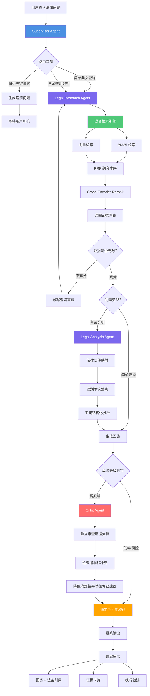
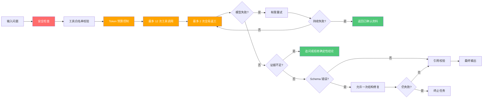

# LawAgent

LawAgent 是一个面向中国大陆法律法规的、证据优先的多 Agent 法律研究系统。Supervisor 动态委派 Legal Research、Legal Analysis 和 Critic Agent；混合检索提供法规证据，确定性校验限制引用范围，前端展示回答、法条和完整执行轨迹。

## Agent 编排架构



### Agent 角色与职责

#### 🎯 Supervisor Agent
**目标**: 理解问题、判断信息完整性、拆分任务、控制预算并汇总结果

**决策能力**:
- 请求用户补充关键事实（澄清路由）
- 委派法规研究任务（简单/复杂路由）
- 委派法律要件分析任务
- 请求独立审查（高风险强制 Critic）
- 在证据不足或预算耗尽时停止并降级

#### 🔍 Legal Research Agent
**目标**: 找到与问题匹配的有效法规证据

**工具权限**:
- `hybrid_search`: 混合检索（BM25 + Vector + RRF）
- `get_article_context`: 获取法条上下文
- `get_law_version`: 查询法规版本
- `find_related_articles`: 查找关联法条

**自主循环**: 制定查询 → 检索 → 评估结果 → 改写查询（最多三轮）

#### ⚖️ Legal Analysis Agent
**目标**: 将用户事实映射为法律要件，识别争议焦点

**工具权限**:
- `read_evidence`: 读取证据内容
- `get_analysis_template`: 获取分析模板

**输出要求**: 区分已陈述事实、合理假设和未知事实

#### 🛡️ Critic Agent
**目标**: 独立检查证据支持、遗漏、冲突和风险表达

**工具权限**:
- `read_evidence`: 读取证据
- `check_claim_support`: 检查结论证据支持
- `check_law_status`: 检查法规效力状态

**强制触发条件**: 刑事、人身安全、重大财产处分等高风险问题

### 控制与降级机制



**保障措施**:
- ✅ Supervisor 只能选择白名单 Agent
- ✅ Research 最多三轮检索
- ✅ 全局最多两次返工
- ✅ Token、工具调用、墙钟时间预算
- ✅ 证据不足时明确说明不确定性
- ✅ 高风险问题强制 Critic + 专业建议

## 已实现能力

- 1032 份本地法规的 DOCX 结构化解析与质量审计。
- 按“法—章—条”切分、正文哈希去重和旧 DOC 隔离。
- BM25 + `text-embedding-v4` + RRF 混合检索。
- 可恢复的批量向量缓存与压缩 NumPy 索引。
- Supervisor、Research、Analysis、Critic 多 Agent 协作。
- `gpt-5.4-mini` 结构化决策、分析、生成和高风险审查。
- 工具预算、重试上限、证据不足降级和高风险提示。
- SQLite 会话、运行事件、法条证据持久化。
- FastAPI、SSE 事件回放和 Next.js 法律研究工作台。
- 检索、引用、Agent、API 与前端自动化测试。

## 本地启动

要求 Python 3.11+、Node.js 20.9+。

```powershell
python -m pip install -e ".[dev]"
npm --prefix frontend install
Copy-Item .env.example .env
```

在 `.env` 中配置 OpenAI-compatible Chat 与 Embedding 服务。`.env` 已被 Git 忽略，禁止提交真实密钥。

### 1. 导入法规

```powershell
python -m app.cli ingest `
  --input RAG `
  --output data/normalized/law_articles.jsonl `
  --report data/reports/corpus.json
```

当前语料审计结果：1032 个文件，1024 个成功，5 个重复，3 个旧 DOC 隔离，共 45,552 个法条单元。

法条编号同时支持“第一百二十条之一”等补充条款；复合规范内部重新编号时会生成稳定且唯一的 ID。当前规范化结果为 45,552 条、45,552 个唯一 ID。

### 2. 构建向量索引

```powershell
python -m app.cli build-index `
  --input data/normalized/law_articles.jsonl `
  --index data/indexes/law `
  --cache data/indexes/embedding-cache.db `
  --batch-size 10 `
  --workers 8
```

每批结果立即写入 SQLite 缓存。中断后重复执行同一命令即可从缺失法条继续。

当前完整索引使用 `text-embedding-v4`，共 45,552 × 1024 维，压缩后约 162 MB。最终落盘采用单遍矩阵构建，避免将全部向量膨胀为 Python 浮点对象。

### 检索评测

150 条固定精确法条查询集上的实测结果：Recall@10 100%、MRR 0.9567、P50 18.0 ms、P95 21.2 ms。明确法名和条号的请求走确定性精确通道；其余请求继续使用 BM25 + 向量 + RRF，不能把这一精确集成绩等同于开放式法律问答准确率。评测明细生成在 `data/evaluation/`，该目录不提交 Git。

### 3. 启动开发服务

```powershell
uvicorn app.main:app --host 127.0.0.1 --port 8000
npm --prefix frontend run dev
```

访问 `http://127.0.0.1:3000`。Next.js 将 `/api/*` 同源代理到后端。

## Docker Compose

```powershell
docker compose up --build
pwsh scripts/smoke-test.ps1
```

统一入口为 `http://127.0.0.1:8080`。只有 Nginx 暴露公网端口；法规目录只读挂载，索引与 SQLite 写入 `data/`。

## 测试

```powershell
python -m pytest backend/tests --cov=app --cov-report=term-missing
python -m ruff check backend/app backend/tests
npm --prefix frontend test -- --run
npm --prefix frontend run typecheck
npm --prefix frontend run build
```

## API

- `POST /api/v1/chat`：创建咨询运行。
- `GET /api/v1/chat/{run_id}/events`：SSE Trace 回放。
- `GET /api/v1/sources/{article_id}`：法条证据。
- `GET/DELETE /api/v1/sessions/{session_id}`：会话读取与删除。
- `GET /api/v1/health`、`GET /api/v1/ready`：存活与就绪检查。
- `GET /api/v1/admin/corpus/report`：需要 `x-admin-key`。

## 安全边界

- 系统提供法律信息检索与辅助分析，不替代执业律师。
- Agent 只能调用白名单检索工具，不能执行任意代码或网络请求。
- 高风险事项强制进入 Critic，并建议寻求专业帮助。
- 模型异常时回退到确定性流程；证据不足时不生成确定性结论。
- 日志和异常不打印 API Key、原始用户敏感信息或模型隐藏思维链。

完整架构、指标与面试演示方案见 [docs/design.md](docs/design.md)。
